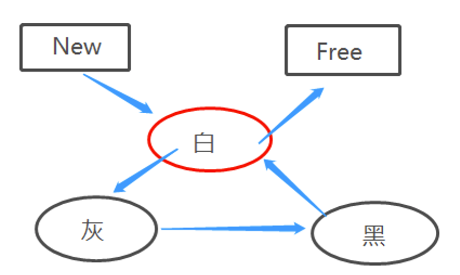
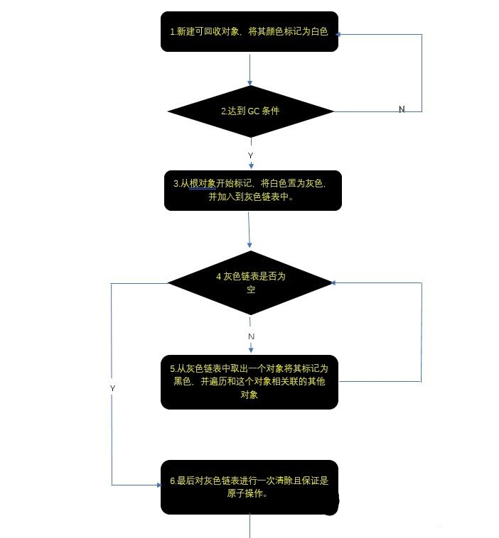
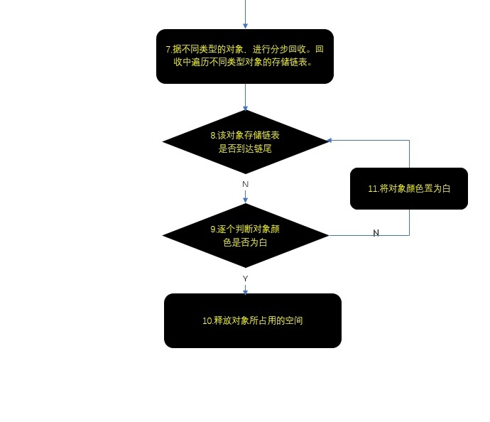

### Lua 垃圾回收

---
- [1. 垃圾回收](#1-垃圾回收)
- [2. 弱引用表](#2-弱引用表)
	- [2.1 记忆函数](#21-记忆函数)
	- [2.2 对象属性](#22-对象属性)
	- [2.3 具有默认值的表](#23-具有默认值的表)
- [3. 瞬表](#3-瞬表)
- [4. 析构器](#4-析构器)
- [5. 垃圾收集器](#5-垃圾收集器)
	- [5.1 Lua Garbage Collection（5.4.4）](#51-lua-garbage-collection544)
- [6. 控制垃圾收集的步长](#6-控制垃圾收集的步长)
- [7. 垃圾回收算法原理](#7-垃圾回收算法原理)
	- [7.1 颜色标记](#71-颜色标记)
	- [7.2 垃圾回收详细过程](#72-垃圾回收详细过程)

---
## 1. 垃圾回收

- Lua 使用自动内存管理，通过垃圾收集自动地删除称为垃圾的对象。一般而言，垃圾收集器是不可见的。弱引用表（weak table）、析构器（finalizer）、函数 ```collectgarbage``` 是 Lua 中用来辅助垃圾收集器的主要机制
  - 弱引用表允许收集 Lua 中还可以被程序访问的对象
  - 析构器允许收集不在垃圾收集器直接控制下的外部对象
  - 函数 ```collectgarbage``` 允许控制垃圾收集器的步长

-

---
## 2. 弱引用表

- 所谓弱引用是一种不在垃圾收集器考虑范围内的对象引用。如果对一个对象的所有引用都是弱引用，那么垃圾收集器将会回归这个对象并删除这些弱引用
- Lua 通过弱引用表实现弱引用，弱引用表就是元素均为弱引用的表，即如果一个对象只被一个弱引用表持有，那么 Lua 最终会回收这个对象
- 表由键值对组成，两者都可以容纳任何类型的对象。对于一个弱引用表，只要一个弱引用的键或值被回收，就把这个键值对从表中删除；一个表是否为弱引用表是由元表中是否有 ```__mode``` 字段决定，它的值为 ```"k"``` 表示这个表的键是弱引用的，```"v"``` 表示值是弱引用的，```"kv"``` 表整个键值对是弱引用
- 只有对象可以从弱引用表中移除，数字、布尔、字符串等是不可回收的，除非它们相关联的对象（可以是表、函数等）被回收

```lua
local mt = { __mode = "v" } -- 值弱引用
local a = {}
local b = { key = a }
setmetatable(b, mt)
print(b.key)      -- table: 000001F0DD803580
a = nil
print(b.key)      -- table: 000001F0DD803580
collectgarbage()  -- 强制垃圾回收
print(b.key)      -- nil
```

---
### 2.1 记忆函数

- 通过记忆函数和空间换时间的概念，保存调用函数的执行结果，在后续使用相同参数再次调用该函数时直接返回记忆的结果，来加快函数的运行速度（例如函数 ```load```、```loadfile```）
- 例如设计一个记忆函数，用于保存 ```load``` 函数的调用结果，当输入相同的参数时，先从记忆表中查找结果，未找到时调用 ```load```（调用 ```load``` 的开销很昂贵）
- 这种模式节省的开销客观，但也容易导致不易察觉的资源浪费，在运行一段足够长的时间后，这类行为会耗尽服务器的内存。可以利用弱引用表的方式，使得每个垃圾收集周期都会删除所有那个时刻未使用的编译结果

```lua
local results = {}
setmetatable(results, {__mode = "v"})	-- 弱引用关联
-- 如果值为不可回收类型（数字、字符串），可以设置为 kv
local mem_loadstring(s)
    local res = results[s]
    if res == nil then
        res = assert(load(s))
        results[s] = res
    end
    return res
end
```

---
### 2.2 对象属性

- 弱引用表的一种重要应用是将属性与对象关联起来。当对象是一个表时，可以通过适当的唯一键把属性存储在这个表自身中
- 想要保持属性的私有性时，或不想让属性干扰表的遍历时，就需要利用外部表作为对象和属性的映射，即对偶表示（将对象用作键、将对象的属性用作值）
- Lua 无法回收一个正在被用作键的对象，使用弱引用表可以在键没有任何关联时，被垃圾收集器捕获

```lua
local mt = {__mode = "k"}
local property = {}
setmetatable(property, mt)
property[table] = value
```

---
### 2.3 具有默认值的表

- 基于记忆函数和对偶表示两种通用技术，使用一个弱引用表来映射每一个表和它的默认值

> 记忆模式

```lua
local metas{}
setmetatable(metas, {__mode = "v"})
function setDefault(t, d)
    local mt = metas[d]
    if not mt then
        mt = {__index = function() return d end}
        metas[d] = mt	-- 记忆
    end
    setmetatable(t, mt)
end
```

> 对偶模式

```lua
local defaults = {}
setmetatable(defaults, {__mode = "k"})
local mt = {__index = function(t) return defaults[t] end}
function setDefault(t, d)
    defaults[t] = d
    setmetatable(t, mt)
end
```

---
## 3. 瞬表

- 垃圾回收中一种棘手的情况是，一个具有弱引用键的表中的值又引用了对应的键，从而弱引用键总是会被关联。一个典型的示例是常量函数工厂（参数是一个对象，返回值是一个被调用时返回传入对象的函数）

```lua
t[o] = function return (function() return o end) end
-- 值中引用了键本身
```

> 使用记忆技术的常量函数工厂

```lua
do
    local mem = {}
    setmetatable(mem, {__mode = "k"})
    function factory(o)
        local res = mem[o]
        if not res then
            res = (function() return o end)
            mem[o] = res	-- 对象和常量函数关联
        end
        return res
    end
end
```

- 表 ```mem``` 中与一个对象关联的值回指了自己的键（对象本身），虽然对象作为键是弱引用的，但是表中的值不是弱引用的。从弱引用表的概念中，每一个函数都指向其对应的键对象，因此对于每一个键来说都存在一个强引用。所以即使有弱引用的键，这些对象也不会被回收
- 在 Lua 中，一个具有弱引用键和强引用值的表是一个瞬表。在一个瞬表中，一个键的可访问性控制着对应值的可访问性
- 对于瞬表的一对 ```(k,v)```，指向 v 的引用只有当存在某些指向 k 的其他外部引用存在时才是强引用，否则即使 v 直接或间接地引用了 k，垃圾收集器最终会收集 k 并把元素从表中移除

---
## 4. 析构器

- 垃圾收集器的目标是回收对象，而析构器是一个与对象关联的函数，当该对象即将被回收时该函数会被调用。在每个垃圾收集周期，垃圾收集器会在调用析构器之前清理弱引用表中的值，在调用析构器之后再清理键
- Lua 通过元方法 ```__gc``` 实现析构器。通过给对象设置一个具有非空 ```__gc``` 元方法的元表，就可以把一个对象标记为需要进行析构处理。若是预先设置完元表而该元表没有 ```__gc``` 字段，则不会将该对象设置为需要析构状态，即使后续给元表增加了元方法 ```__gc```
- 析构器不能产生或运行垃圾收集器，因为它们可以在不可预知的时间内运行。运行终结器时的任何错误都会产生警告，且错误不会传播

```lua
o = {x = "hi"}
setmetatable(o, {__gc = function(o) print(o.x) end})
o = nil
collectgarbage()    --> hi
```

- 当垃圾收集器在同一个周期中析构多个对象时，它会按照对象被标记为需要析构处理的顺序逆序调用这些对象的析构器

```lua
local mt = { __gc = function(o)
    print(o.x)
end }
local t1 = { x = 1 }
local t2 = { x = 2 }
setmetatable(t1, mt)
setmetatable(t2, mt)
t1 = nil
t2 = nil
collectgarbage()    -- 2 , 1
```

> 复苏

- 有关析构器的一个特性是复苏（resurrection）。当一个析构器被调用时，它的参数是正在被析构的对象。这个对象在析构期间重新变成活跃（临时复苏），如果该对象在析构器返回后仍然可访问（析构时保存到全局变量时），这个对象就变成永久复苏

```lua
A = {x = "this is  A"}
B = {f = A}
setmetatable(B, {__gc = function(o) print(o.f.x) end})
A, B = nil
collectgarbage()	--> this is A
```

- 由于复苏的存在，Lua 会在两个阶段中回收具有析构器的对象。当垃圾收集器首次发现某个析构器的对象不可达时，垃圾收集器把这个对象复苏并将其放入等待被析构的队列中，一旦析构器开始执行，Lua 就将该对象标记为已被析构，当下一次垃圾收集器又发现这个对象不可达时，它就将这个对象删除

> atexit 函数

- 每一个对象的析构器都只会精确地运行一次。程序结束时，Lua 也会显式的调用所有未被释放的对象的析构器。因此可以利用在程序结束时的这种特性实现某种形式的 ```atexit()```，即在程序完全终结前立即运行的函数。可以将这个特殊的表锚定在全局表中

```lua
local t = {__gc = function()
    -- 'atexit' 的代码
    print("finishing Lua program")
end}
setmetatable(t, t)
_G["*AA*"] = t
```

> 在每次 GC 后运行一个函数

```lua
local mt = {__gc = function(o)
    -- GC 后的工作
    print("new GC cycle")
    -- 为下一次垃圾收集创建新对象
    setmetatable({}, getmetatable(o))
end}
setmetatable({}, mt)
collectgarbage()	-- new GC cycle
collectgarbage()	-- new GC cycle
```

---
## 5. 垃圾收集器

- Lua 执行自动内存管理，通过运行一个垃圾收集器来收集所有的死对象来自动管理内存，其中 `string`、`table`、`userdata`、`function`、`thread`、`internal struct` 等都是自动管理的对象；但是 Lua 从不收集通过注册表可访问的对象（C function 等），也包括全局环境

> 标记清除式垃圾收集器

- 一直到 Lua5.0 使用的都是标记清除式垃圾收集器。这种垃圾收集器的特点是会时不时地停止主程序的运行来执行一次完整的垃圾收集周期：标记（mark）、清理（cleaning）、清除（sweep）、析构（finalization）
  - 标记：把根节点集合（由 Lua 可以直接访问的对象组成）标记为活跃，这个集合只包括 C 注册表。保存在一个活跃对象中的对象是程序可达的，弱引用表中的元素不遵循这个规则。当所有可达对象被标记为活跃时，标记阶段完成
  - 清理：Lua 主要处理析构器和弱引用表。首先 Lua 遍历所有被标记为需要进行析构但未被标记为活跃状态的对象重新标记为活跃（复苏），并被放在一个单独的列表中（析构阶段会用到）。然后 Lua 遍历弱引用表并从中移除键或值未被标记的元素
  - 清除：遍历所有对象（Lua 会把所有创建的对象放在一个链表中），所有非活跃对象被回收，活跃对象被清理标记，进入下一个清除阶段
  - 析构：Lua 调用清理阶段被分离出的对象的析构器

> 增量式垃圾收集器

- Lua5.1 使用了增量式垃圾收集器，也会像老版一样执行相同的步骤。与标记清除式不同的是，不需要再垃圾收集期间停止主程序的运行。增量式与解释器一起交替运行，解释器可能会改变一个对象的可达性，为了保证收集的正确性，垃圾收集器中的有些操作具有发现危险改动和纠正涉及对象标记的内存屏障

> 紧急垃圾收集

- Lua5.2 引入了紧急垃圾收集。当内存分配失败时，Lua 会强制进行一次完整的垃圾收集，并再次尝试分配。这些紧急情况可以发生在 Lua 进行内存分配的任意时刻，包括 Lua 处于不一致的代码执行状态时。这类型的垃圾收集动作不能运行析构器

---
### 5.1 Lua Garbage Collection（5.4.4）

- 在 Lua54 之后，GC 可以在两种模式下工作，增量式或分代式
- GC 的缺省模式和缺省参数一般而言是可行的，但是 GC 行为在不同的平台和不同的 Lua 版本之间是不可移植的，最佳设置也是不可移植的

> 增量模式

- 每个 GC 周期以小步骤执行标记、扫描和收集，并与程序的执行交替运行，收集器可以使用通过参数周期 `pause`（通过 `setpause`）、步长倍率 `stepmul`（通过 `setstepmul`）、步长 `stepsize`（通过 `step`）控制

> 分代垃圾收集

- 分代模式下，收集器经常进行次要收集，只遍历最近创建的对象，若小收集之后内存的使用仍高于限制，收集器将执行 `stop-the-world` 大收集（遍历所有对象）
- 代入模式使用两个参数，次要收集频率和主要收集频率
  - 对于次要收集频率 x，在前一个主要收集后，当内存增长到比正在使用的内存大 x%，将执行次要收集。默认值为 20，最大值为 200
  - 对于主要收集频率 y，在前一个主要收集后，当内存增长到比使用的内存大 y% 时，将执行主要收集。默认值为 100（超过上一次收集后使用量的两倍），最大值为 1000

---
## 6. 控制垃圾收集的步长

- 在函数 ```collectgarbage(opt, ...)``` 中，```opt``` 提供了一个可选参数用来说明收集器进行何种操作：
  - ```"stop"```：停止垃圾收集器，直到使用选项 ```"restart"``` 调用 ```collectgarbage```
  - ```"restart"```：重启垃圾收集器
  - ```"collect"```：执行一次完整的垃圾收集，回收和所有不可达的对象（默认）
  - ```"step"```：执行某些垃圾收集工作，第二个参数 ```data:integer``` 指明工作量，默认值为 13
  - ```"count"```：以 KB 为单位返回当前已用的内存数，包括了尚未被回收的死对象
  - ```"setpause"```：设置收集器的 pause 参数（间歇率），```data``` 以百分比给出设定的新值，data = 100，参数设定为 1（100%）
  - ```"setstepmul"```：设置收集器的 stepmul 参数（步进倍率），```data``` 为百分比单位，默认值为 100%

- ```pause``` 和 ```stepmul``` 控制着垃圾收集器的角色。任何垃圾收集器都是使用 CPU 时间换内存空间。不消耗 CPU 时间是以巨大的内存消耗为代价的，而程序能够使用尽可能少的内存，都是以巨大的 CPU 消耗为代价的。```pause``` 和 ```stepmul``` 用于平衡这两个极端：
  - ```pause``` 用于控制垃圾收集器在一次收集完成后等待多久再开始新的一次收集（0 表示在上一次垃圾回收结束后立即开始新的收集，200% 使得等待时间翻倍）。该值等于小于 100 意味着收集器不会等待便开始一个新的循环，200 表示等待正在使用的内存翻倍时才开始一个新的周期；最大值为 1000
  - ```stepmul``` 控制对于每分配 1KB 内存，垃圾收集器应该进行多少工作，即收集器相对于内存分配的速度。小于 100 时会使收集器过于缓慢，并可能导致收集器永远无法完成一个周期。默认值为 100，最大值为 1000
  - `step` 控制每个增量步骤的大小，较大的值会使收集器的行为像标记清除式垃圾收集器。默认为 13，即大约 8kb 的步长，解释器每分配大约 8kb 内存就进行一次收集

---
## 7. 垃圾回收算法原理

- Lua 采用了标记清除式（Mark and Sweep）GC 算法：每次执行 GC 时，先以若干根节点开始，逐个把直接或间接和它们相关的节点都做上标记；清除：当标记完成后，遍历整个对象链表，把被标记为需要删除的节点一一删除即可

---
### 7.1 颜色标记

- Lua 用白、灰、黑三色来标记一个对象的可回收状态，其中白色又分为**白 1**，**白 2**

> **白色**：可回收状态（未标记待访问，标记待回收）

- 如果该对象未被 GC 标记过则此时白色代表当前对象为待访问状态。
- 新创建的对象的初始状态就应该被设定为白色，因为该对象还没有被 GC 标记到，所以保持初始状态颜色不变，仍然为白色
- 如果该对象在 GC 标记阶段结束后，仍然为白色则此时白色代表当前对象为可回收状态。但其实本质上白色的设定就是为了标识可回收

> **灰色**：中间状态（已访问待标记）

- 当前对象为待标记状态。当前对象已经被 GC 访问过，但是该对象引用的其他对象还没有被标记

> **黑色**：不可回收状态（标记不可回收）

- 当前对象为已标记状态。当前对象已经被 GC 访问过，并且对象引用的其他对象也被标记了。（表示有引用关联）

> 白色分为白 1 和白 2

- 在 GC 标记阶段结束而清除阶段尚未开始时，如果新建一个对象，由于其未被发现引用关系，原则上应该被标记为白色，于是之后的清除阶段就会按照白色被清除的规则将新建的对象清除。这是不合理的
- 于是 Lua 用两种白色进行标识，如果发生上述情况，Lua 依然会将新建对象标识为白色，不过是 “当前白”（比如白 1）。而 Lua 在清扫阶段只会清扫 “旧白”（比如白 2）
- 在清扫结束之后，则会更新 “当前白”，即将白 2 作为当前白。下一轮 GC 将会清扫作为 “旧白” 的白 1 标识对象



---
### 7.2 垃圾回收详细过程





---